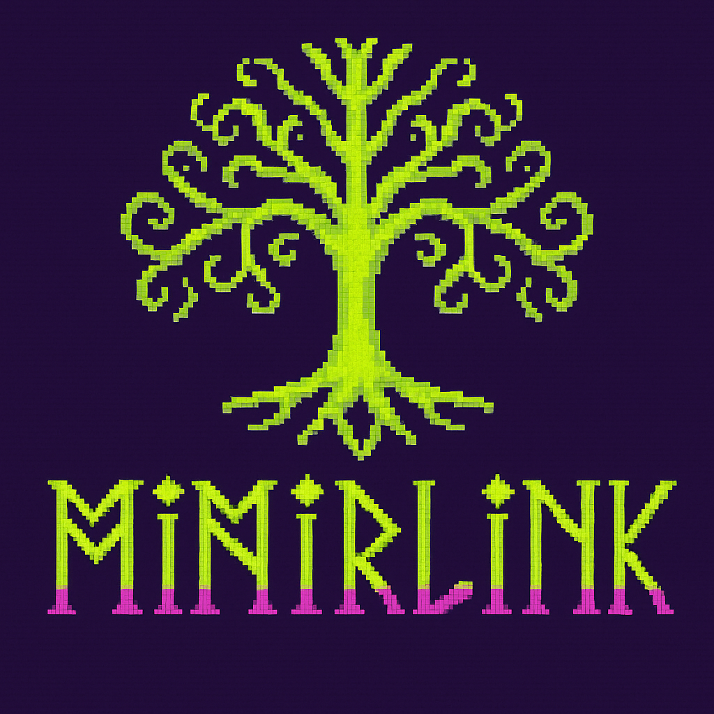

[](https://npmjs.org/mimirlink)  

# ᛗᛁᛗᛁᚱᛚᛁᚾᚲ - ("M I M I R L I N K")

<!--  -->


[](https://github.com/comcy/MimirLink/actions/workflows/validate.yml) 

MímirLink is a minimal, markdown-inspired note-taking tool designed for thought organization and idea connection. Lightweight, fast, and fully local - it empowers users to work with markdown based notes, journaling and todos by proving minimal set of tools in a cli.

Tools and workflows side by side.

> Currently the tool is under development.
> See the [current](#current-features) and the [planned](#plannned-features) feature set.

## Current Features

### Workspace structure
```
.mimirlink/
├── .ygg/
│   ├── templates/
│   |    └── page.html
|   └── styles/
│       └── style.css
├── journals/
│   ├── 2024-04-20.md
│   ├── 2024-04-21.md
│   └── ...
├── pages/
│   ├── test.md
│   ├── sample.md
│   └── ...
└── TODO.md

```

#### Note types

- Journals
  `journal new [name]?` 
  - creates a new journal page for today (if not already existing)
  - `[name]` (optional) can create journal pages for a given date
- Pages
    `page new [name]!` 
  - creates a new page with the provided name
  - `[name]` creates the page with the provided name
- TODOs
  - `todo [text] -s [scope] -d [date] -p [priority]`   

#### Workflow facilitation

- `#tags`
  - tags are easy to use references for anything you like
  - if a tag is not already existing it will be a new page created with the tags name after a `sync`
- `sync`
  - provides the power to resolved references set by `#tags` from markdown files to other markdown files
  - each tag is represented by a single markdown file if a `#tag` is not formarly existing a new page is created 
  - tags are written into the 
- `watch`
  - you can run the application in a `watch` mode which automates the `sync` command by observing file changes within the workspace

## Usage

npm install -g

ygg

### Command Mode

### Interactive Mode

## Developmemt

npm install

npm run build

npm run start

## Plannned features

- TODO integration
  - Split todos in scope based files
  - e.g. due date based journal integration via "sync" command
  - Tagged pages should have a referenced section on it which lists all pages the tag was set


- FOSS / 3rd party licensing
- 404-Seite generieren
- Sitemap & RSS-Feed
- Frontmatter-basierte Metadaten wie date, tags, draft verwenden
